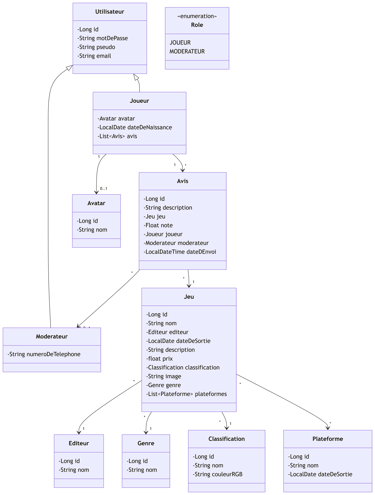
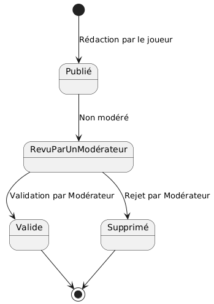
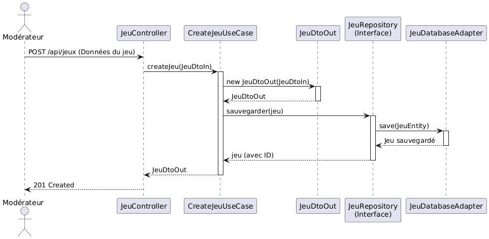

# Dossier architectural - Projet avis (Clean architecture)

> Application de gestion d'avis de jeux vidéo développée avec **Spring Boot 4** en respectant les principes de **Clean Architecture** (Uncle Bob).

---

## Table des matières

1. [Présentation du projet](#présentation-du-projet)
2. [Architecture logicielle](#architecture-logicielle)
3. [Diagramme de classes](#diagramme-de-classes)
4. [Principes SOLID — Exemples de code](#principes-solid--exemples-de-code)
5. [Diagramme d'état-transition — Objet Avis](#diagramme-détat-transition--objet-avis)
6. [Diagramme de séquence — Ajouter un jeu](#diagramme-de-séquence--ajouter-un-jeu)
7. [Besoins fonctionnels](#besoins-fonctionnels)
8. [Sécurité — JWT](#sécurité--jwt)
9. [Lancer le projet](#lancer-le-projet)
10. [Tests](#tests)

---

## Présentation du projet

Ce projet est une refonte de l'application **Avis** (développée jusqu'en avril 2025) dans une approche **Clean Architecture**, conformément aux recommandations d'[Uncle Bob](https://blog.cleancoder.com/uncle-bob/2012/08/13/the-clean-architecture.html).

L'objectif est de rendre l'application **centrée sur le métier** et **indépendante du framework**, en séparant clairement les responsabilités en couches concentriques.

---

## Architecture logicielle

L'application est découpée en **3 couches** principales, suivant la règle de dépendance (les couches internes ne connaissent jamais les couches externes) :

```
┌───────────────────────────────────────────────────────────────┐
│                    ADAPTER (Infrastructure)                   │
│  ┌─────────────────┐  ┌──────────────────┐  ┌────────┐        │
│  │   Controllers   │  │   Persistence    │  │Security│        │
│  │  (REST API)     │  │ (JPA / Entities) │  │ (JWT)  │        │
│  └────────┬────────┘  └────────┬─────────┘  └────────┘        │
│           │                    │                              │
├───────────┼────────────────────┼──────────────────────────────┤
│           ▼                    ▼                              │
│                 APPLICATION (Use Cases)                       │
│  ┌────────────┐  ┌────────────┐  ┌───────────┐  ┌───────────┐ │
│  │ Ports IN   │  │ Ports OUT  │  │Use Cases  │  │ Mappers   │ │
│  │(interfaces)│  │(interfaces)│  │(services) │  │(MapStruct)│ │
│  └────────────┘  └────────────┘  └───────────┘  └───────────┘ │
│           │                                                   │
├───────────┼───────────────────────────────────────────────────┤
│           ▼                                                   │
│                    DOMAIN (Entités métier)                    │
│  ┌──────────────────────────────────────────────────────┐     │
│  │  Utilisateur, Joueur, Moderateur, Jeu, Avis,         │     │
│  │  Genre, Editeur, Plateforme, Classification, Avatar  │     │
│  └──────────────────────────────────────────────────────┘     │
└───────────────────────────────────────────────────────────────┘
```

### Structure des packages

```
fr.esgi.avis/
├── domain/
│   └── business/           # Entités métier pures (POJO)
│       ├── Utilisateur.java
│       ├── Joueur.java
│       ├── Moderateur.java
│       ├── Jeu.java
│       ├── Avis.java
│       ├── Genre.java
│       ├── Editeur.java
│       ├── Plateforme.java
│       ├── Classification.java
│       └── Avatar.java
│
├── application/
│   ├── dto/
│   │   ├── in/             # DTOs d'entrée (requêtes)
│   │   └── out/            # DTOs de sortie (réponses)
│   ├── ports/
│   │   ├── in/             # Ports d'entrée (Use Cases interfaces)
│   │   └── out/            # Ports de sortie (Repository interfaces)
│   ├── usecases/           # Implémentations des Use Cases
│   ├── mappers/            # MapStruct mappers (Entity <-> DTO)
│   └── security/           # JwtService + Role enum
│
└── adapter/
    ├── controllers/        # Contrôleurs REST (Spring MVC)
    │   └── dto/            # DTOs spécifiques aux réponses HTTP
    ├── persistence/        # Couche JPA
    │   ├── entity/         # Entités JPA (@Entity)
    │   └── repository/     # Implémentations des ports OUT
    │       └── jpa/        # Interfaces Spring Data JPA
    └── security/           # Filtre JWT + Configuration Spring Security
```

### Règle de dépendance

| Couche | Dépend de |
|--------|-----------|
| **Domain** | Rien (aucune dépendance framework) |
| **Application** | Domain (reprend les entités) |
| **Adapter** | Application |

> La couche **Domain** ne contient aucune annotation Spring, aucun import JPA. Elle est 100% portable.

---

## Diagramme de classes



---

## Principes SOLID — Exemples de code

### S — Single Responsibility Principle (Responsabilité unique)

> Chaque classe n'a qu'une seule raison de changer.

Chaque use case a sa propre classe de service avec une seule responsabilité :

```java
// CreateJeuService -> responsable UNIQUEMENT de la création d'un jeu
@Service
@AllArgsConstructor
public class CreateJeuService implements CreateJeuUseCase {

    private final JeuRepository jeuRepository;

    @Override
    public JeuDtoOut createJeu(JeuDtoIn jeuDtoIn) {
        JeuDtoOut jeuDtoOut = new JeuDtoOut(
            jeuDtoIn.plateformeIds(), jeuDtoIn.genreId(),
            null, jeuDtoIn.nom(), jeuDtoIn.editeurId(),
            jeuDtoIn.dateDeSortie(), jeuDtoIn.description(),
            jeuDtoIn.prix(), jeuDtoIn.classificationId(), jeuDtoIn.image()
        );
        return jeuRepository.save(jeuDtoOut);
    }
}

// GetJeuxService -> responsable UNIQUEMENT de la récupération des jeux
@Service
@AllArgsConstructor
public class GetJeuxService implements GetJeuxUseCase {

    private final JeuRepository jeuRepository;

    @Override
    public List<JeuDtoOut> getAllJeux() {
        return jeuRepository.findAll();
    }
    // ...
}
```

La logique de création et la logique de lecture sont séparées en deux services distincts, chacun avec une seule raison de changer.

---

### O — Open/Closed Principle (Ouvert/Fermé)

> Les entités logicielles doivent être ouvertes à l'extension, fermées à la modification.

L'interface `JeuRepository` (port OUT) peut être étendue par de nouvelles implémentations sans modifier le code existant :

```java
// Port OUT — interface définie dans la couche application
public interface JeuRepository {
    List<JeuDtoOut> findAll();
    Optional<JeuDtoOut> findById(Long id);
    JeuDtoOut save(JeuDtoOut jeuDtoOut);
    void deleteById(Long id);
    List<JeuDtoOut> findByEditeurId(Long editeurId);
    List<JeuDtoOut> findByGenreId(Long genreId);
}

// Implémentation actuelle avec JPA (dans adapter)
@Repository
@AllArgsConstructor
public class JeuRepositoryImpl implements JeuRepository {
    private final JeuJpaRepository jeuJpaRepository;
    private final JeuMapper jeuMapper;
    // ... implémentation avec JPA
}

// On pourrait ajouter une implémentation MongoDB sans modifier JeuRepository :
// public class JeuMongoRepositoryImpl implements JeuRepository { ... }
```

Le use case `CreateJeuService` dépend de l'interface `JeuRepository`, pas de l'implémentation concrète. On peut changer de base de données sans toucher au métier.

---

### L — Liskov Substitution Principle (Substitution de Liskov)

> Les objets d'une classe dérivée doivent pouvoir remplacer les objets de la classe de base sans altérer le programme.

```java
// Classe de base
@Data
public class Utilisateur {
    private Long id;
    private String motDePasse;
    private String pseudo;
    private String email;
}

// Joueur étend Utilisateur — peut être utilisé partout où un Utilisateur est attendu
@Data
@EqualsAndHashCode(callSuper = true)
public class Joueur extends Utilisateur {
    private Avatar avatar;
    private LocalDate dateDeNaissance;
    private List<Avis> avis;
}

// Moderateur étend Utilisateur — même principe
@Data
@EqualsAndHashCode(callSuper = true)
public class Moderateur extends Utilisateur {
    private String numeroDeTelephone;
}
```

Un `Joueur` ou un `Moderateur` peut être utilisé de manière interchangeable partout où un `Utilisateur` est attendu, sans comportement inattendu. Les deux conservent les propriétés `id`, `pseudo`, `email` et `motDePasse` de la classe parente.

---

### I — Interface Segregation Principle (Ségrégation des interfaces)

> Les clients ne doivent pas être forcés de dépendre d'interfaces qu'ils n'utilisent pas.

Les ports d'entrée sont découpés en interfaces fines, chacune dédiée à un use case :

```java
// Interface spécifique à la création d'un jeu
public interface CreateJeuUseCase {
    JeuDtoOut createJeu(JeuDtoIn jeuDtoIn);
}

// Interface spécifique à la lecture des jeux
public interface GetJeuxUseCase {
    List<JeuDtoOut> getAllJeux();
    Optional<JeuDtoOut> getJeuById(Long id);
    List<JeuDtoOut> getJeuxByEditeur(Long editeurId);
    List<JeuDtoOut> getJeuxByGenre(Long genreId);
}

// Interface spécifique à la modération d'un avis
public interface ModerateAvisUseCase {
    AvisDtoOut moderateAvis(Long avisId, AvisDtoIn avisDtoIn);
}
```

Le `JeuController` n'injecte que les interfaces dont il a besoin :

```java
@RestController
@AllArgsConstructor
public class JeuController {
    private final GetJeuxUseCase getJeuxUseCase;       // lecture uniquement
    private final CreateJeuUseCase createJeuUseCase;   // création uniquement
    // Il ne connaît pas ModerateAvisUseCase → ISP respecté
}
```

---

### D — Dependency Inversion Principle (Inversion des dépendances)

> Les modules de haut niveau ne doivent pas dépendre des modules de bas niveau. Les deux doivent dépendre d'abstractions.

C'est le **cœur** de la Clean Architecture. Le use case `CreateJeuService` (haut niveau) dépend de l'interface `JeuRepository` (abstraction), pas de `JeuRepositoryImpl` (bas niveau) :

```java
// Couche APPLICATION — dépend de l'abstraction (interface)
@Service
@AllArgsConstructor
public class CreateJeuService implements CreateJeuUseCase {
    private final JeuRepository jeuRepository; // ← Interface, pas implémentation !

    @Override
    public JeuDtoOut createJeu(JeuDtoIn jeuDtoIn) {
        // ...
        return jeuRepository.save(jeuDtoOut);
    }
}

// Couche ADAPTER — implémente l'abstraction
@Repository
@AllArgsConstructor
public class JeuRepositoryImpl implements JeuRepository {
    private final JeuJpaRepository jeuJpaRepository; // Spring Data JPA
    private final JeuMapper jeuMapper;

    @Override
    public JeuDtoOut save(JeuDtoOut jeuDtoOut) {
        JeuEntity entity = jeuMapper.toEntity(/* ... */);
        JeuEntity saved = jeuJpaRepository.save(entity);
        return jeuMapper.toDto(saved);
    }
}
```

La flèche de dépendance pointe vers l'intérieur : `Adapter → Application ← Domain`. Le framework (Spring, JPA) reste cantonné dans la couche Adapter.

---

## Diagramme d'état-transition — Objet Avis

Un avis passe par différents états au cours de son cycle de vie :



---

## Diagramme de séquence — Ajouter un jeu



---

## Besoins fonctionnels

### En tant que Joueur

| # | Besoin | Endpoint |
|---|--------|----------|
| 1 | Se connecter | `POST /api/auth/joueur/login` |
| 2 | Voir les jeux | `GET /api/jeux` |
| 3 | Voir les avis | `GET /api/avis` |
| 4 | Rédiger un avis | `POST /api/avis` |
| 5 | Se déconnecter | Côté client (suppression du token) |

### En tant que Modérateur

| # | Besoin | Endpoint | 
|---|--------|----------|
| 1 | Se connecter | `POST /api/auth/moderateur/login` |
| 2 | Voir les jeux | `GET /api/jeux` |
| 3 | Ajouter un jeu | `POST /api/jeux` |
| 4 | Modérer un avis | `PUT /api/avis/{id}/moderate` |
| 5 | Se déconnecter | Côté client (suppression du token) | 

---

## Sécurité — JWT

L'application utilise **Spring Security** avec des **tokens JWT** (JSON Web Tokens) pour sécuriser les endpoints.

### Architecture de la sécurité

La sécurité est répartie sur deux couches, en respectant la Clean Architecture :

- **`application/security/`** — Contient la logique métier de génération/validation des tokens (`JwtService`) et l'enum `Role`. Cette couche ne dépend pas de Spring Security, uniquement de la librairie JJWT.
- **`adapter/security/`** — Contient le filtre HTTP (`JwtAuthenticationFilter`) et la configuration Spring Security (`SecurityConfig`). C'est la couche qui intègre le framework.

```
application/security/
├── JwtService.java       # Génération, validation et extraction des claims JWT
└── Role.java             # Enum JOUEUR / MODERATEUR

adapter/security/
├── JwtAuthenticationFilter.java   # Filtre interceptant le header Authorization
└── SecurityConfig.java            # Chaîne de filtres Spring Security
```

### Fonctionnement

1. Le client s'authentifie via `POST /api/auth/joueur/login` ou `POST /api/auth/moderateur/login`
2. Le serveur valide les identifiants et retourne les infos utilisateur avec un **token JWT** contenant :
   - `sub` : le pseudo de l'utilisateur
   - `role` : `JOUEUR` ou `MODERATEUR`
   - `iat` : date d'émission
   - `exp` : date d'expiration (24h par défaut)
3. Le client envoie le token dans le header `Authorization: Bearer <token>` pour les requêtes protégées
4. Le filtre `JwtAuthenticationFilter` intercepte chaque requête, extrait le token, le valide via `JwtService`, puis injecte une authentification Spring Security avec l'autorité `ROLE_JOUEUR` ou `ROLE_MODERATEUR` dans le `SecurityContext`

### Matrice d'accès

| Route | Méthode | Accès |
|-------|---------|-------|
| `/api/auth/**` | POST | Public (pas de token requis) |
| `/api/jeux` | POST | `ROLE_MODERATEUR` uniquement |
| `/api/avis/*/moderate` | PUT | `ROLE_MODERATEUR` uniquement |
| Toute autre route | * | Authentifié (token JWT valide requis) |

### Exemple de réponse au login (Joueur)

```json
{
    "id": 1,
    "pseudo": "AliceGamer",
    "email": "alice@example.com",
    "dateDeNaissance": "1995-05-15",
    "avatarId": 1,
    "token": "eyJhbGciOiJIUzM4NCJ9.eyJzdWIiOiJBbGljZUdhbWVyIiwicm9sZSI6IkpPVUVVUiIsImlhdCI6..."
}
```

### Exemple de réponse au login (Modérateur)

```json
{
    "id": 3,
    "pseudo": "ModAdmin",
    "email": "mod@avis.com",
    "numeroDeTelephone": "0123456789",
    "token": "eyJhbGciOiJIUzM4NCJ9.eyJzdWIiOiJNb2RBZG1pbiIsInJvbGUiOiJNT0RFUkFURVVSIiwiaWF0Ijo..."
}
```

> **Clean Architecture** : le `JwtService` (couche Application) ne connaît pas Spring Security. Le `JwtAuthenticationFilter` (couche Adapter) fait le pont entre le token et le `SecurityContext` de Spring. La couche Domain ne connaît ni l'un ni l'autre.

---

## Lancer le projet

```bash
# Cloner le projet
git clone https://github.com/Luigi1802/avis_m2_clean_archi.git
cd avis_m2_clean_archi

# Lancer l'application
./mvnw spring-boot:run

# Accès
# API :          http://localhost:8080
# Swagger UI :   http://localhost:8080/swagger-ui.html
# H2 Console :   http://localhost:8080/h2-console
```

### Données de test (DataLoader)

L'application charge automatiquement des données au démarrage :

| Type | Données |
|------|---------|
| Joueurs | `AliceGamer` / `BobPlayer` (mdp: `password`) |
| Modérateur | `ModAdmin` (mdp: `password`) |
| Jeux | Assassin's Creed Valhalla, FIFA 23, Zelda BOTW, The Witcher 3 |
| Avis | 4 avis pré-remplis |

---

## Tests

### Organisation des tests par couche

| Couche | Ce qu'on teste | Outils |
|--------|----------------|--------|
| **Domain** | Logique métier des entités | JUnit 5 |
| **Application** | Use Cases (services) | JUnit 5 + Mockito (mock des ports OUT) |
| **Adapter** | Contrôleurs REST, Repositories | JUnit 5 + MockMvc + @DataJpaTest |

### Lancer les tests

```bash
./mvnw test
```
